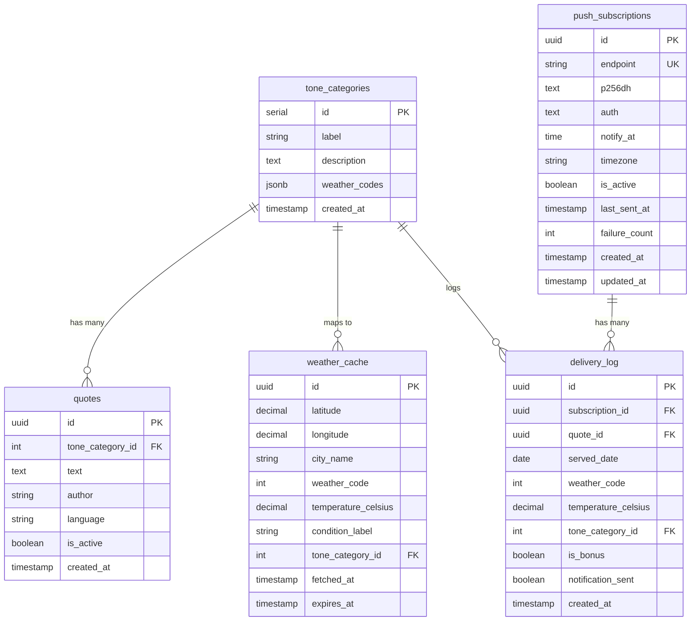

# Database Schema

## Tables Overview

## Table Details

### tone_categories
Maps weather conditions to quote tone categories.

| Column | Type | Description |
|--------|------|-------------|
| id | serial | Primary key |
| label | string | Category name (e.g., "Energy & Action") |
| description | text | Category description |
| weather_codes | jsonb | Array of WMO weather codes |
| created_at | timestamp | Creation timestamp |

### quotes
Motivational quotes classified by tone.

| Column | Type | Description |
|--------|------|-------------|
| id | uuid | Primary key |
| tone_category_id | int | FK to tone_categories |
| text | text | Quote content |
| author | string | Quote author |
| language | string | Language code (en/fil) |
| is_active | boolean | Whether quote is available |
| created_at | timestamp | Creation timestamp |

### push_subscriptions
Web Push notification subscriptions.

| Column | Type | Description |
|--------|------|-------------|
| id | uuid | Primary key |
| endpoint | string | Push endpoint URL (unique) |
| p256dh | text | VAPID public key |
| auth | text | VAPID auth secret |
| notify_at | time | Preferred notification time |
| timezone | string | User's timezone |
| is_active | boolean | Subscription status |
| last_sent_at | timestamp | Last notification sent |
| failure_count | int | Consecutive failures |
| created_at | timestamp | Creation timestamp |
| updated_at | timestamp | Last update |

### delivery_log
Tracks which quotes were served to which subscriptions.

| Column | Type | Description |
|--------|------|-------------|
| id | uuid | Primary key |
| subscription_id | uuid | FK to push_subscriptions |
| quote_id | uuid | FK to quotes |
| served_date | date | Date quote was served |
| weather_code | int | Weather at time of serving |
| temperature_celsius | decimal | Temperature at serving |
| tone_category_id | int | FK to tone_categories |
| is_bonus | boolean | Whether this was a bonus quote |
| notification_sent | boolean | Whether notification was sent |
| created_at | timestamp | Creation timestamp |

### weather_cache
Caches weather data to reduce API calls (60-minute TTL).

| Column | Type | Description |
|--------|------|-------------|
| id | uuid | Primary key |
| latitude | decimal | Location latitude |
| longitude | decimal | Location longitude |
| city_name | string | City name |
| weather_code | int | WMO weather code |
| temperature_celsius | decimal | Temperature in Celsius |
| condition_label | string | Human-readable condition |
| tone_category_id | int | FK to tone_categories |
| fetched_at | timestamp | When weather was fetched |
| expires_at | timestamp | Cache expiration |